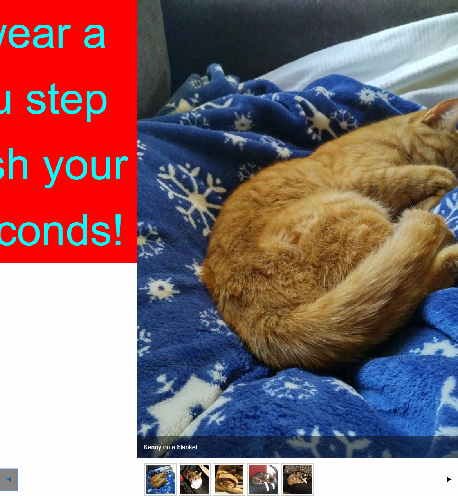

# foundation-orbit-unselectable-slides-demo
An explanation on how to make an orbit media component using the Foundation CSS framework that has some unselectable slides

Three paths:
* original/index.html - has the original working orbit of my cat pictures
* broken/index.html - has the broken code trying to insert the unselectable slide
* fixed/index.html - has the html with the fix that allows for an unselectable slide, and fixes the bugs

